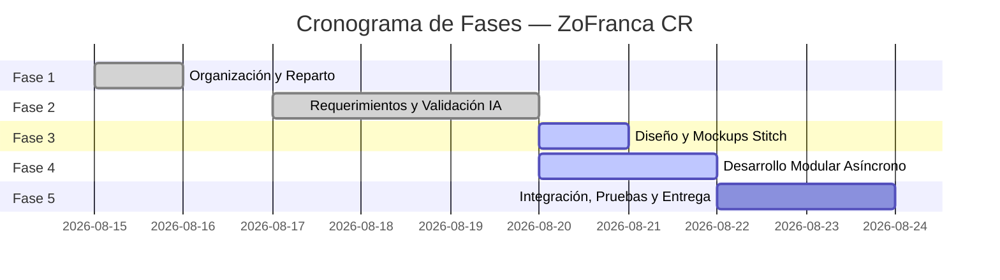

# Hoja de Ruta — ZoFranca CR

Plan de trabajo, estado de avance y distribución de responsabilidades del proyecto ZoFranca CR.

---

## 1. Responsabilidades del equipo

| Integrante | Rol | Responsabilidades principales |
|---|---|---|
| **Ernesto Libby Lugo** | Co-desarrollador | Estructura inicial, RF-01 a RF-05, módulo base de solicitudes, configuración inicial `json-server`, IA base. |
| **Ulysses Quirós V.** | Líder técnico / Desarrollador | RF-06 a RF-18, RNF-01 a RNF-09, glosario, matriz de trazabilidad, validación IA, diseño y mockups Stitch, módulos de cumplimiento, alertas, dashboard consolidado, reportesService, manejo global de errores y asincronía (`Promise.all`). |

---

## 2. Fases del proyecto y estado de avance

---

### Fase 1: Organización del proyecto
- [x] Reparto formal de roles y responsabilidades.
- [x] Estructura de carpetas (`css/`, `docs/`, `js/`, `mockups/`, `pages/`).
- [x] Configuración de repositorio Git y estrategia de ramas (`feature/*`).
- [x] Configuración de `package.json` y dependencias (`json-server`).

### Fase 2: Requerimientos y Validación de Calidad
- [x] Documentación de Introducción, Objetivos y Análisis del Negocio.
- [x] Especificación de RF-01 a RF-05 (Solicitudes e IA base).
- [x] Especificación de RF-06 a RF-18 (Cumplimiento, Alertas, Dashboard, Asincronía, Auditoría).
- [x] Especificación de RNF-01 a RNF-09 con métricas cuantificables.
- [x] Elaboración del Glosario de 12 términos técnicos y normativos.
- [x] Historias de usuario (HU-01 a HU-12) categorizadas por actor.
- [x] Criterios de aceptación detallados en formato Dado/Cuando/Entonces para todos los RF.
- [x] Matriz de trazabilidad integral (HU $\to$ RF $\to$ CA $\to$ RNF $\to$ Código).
- [x] Ejecución del Intento 1 de Validación IA (Puntaje 77/100, Rechazado).
- [x] Corrección de las 3 observaciones obligatorias (UTF-8, Trazabilidad, Verificabilidad).
- [x] Preparación del protocolo y prompt oficial para el Intento 2 de Validación IA.

### Fase 3: Diseño y Mockups Stitch
- [x] Documentación arquitectónica de vistas en `mockups/README.md`.
- [x] Definición de prompts de generación visual para Stitch de las 5 pantallas clave:
  1. *Formulario de Solicitud de Instalación* (`pages/solicitudes.html`)
  2. *Detalle y Evaluación Asistida por IA* (`pages/detalle-solicitud.html`)
  3. *Formulario de Reportes de Cumplimiento* (`pages/cumplimiento.html`)
  4. *Panel de Gestión de Alertas de Incumplimiento* (`pages/alertas.html`)
  5. *Dashboard Ejecutivo y Métricas Consolidadas* (`pages/dashboard.html` / `index.html`)

### Fase 4: Desarrollo Modular Frontend y Backend Simulado
- [x] Configuración y enriquecimiento de base de datos simulada en `db.json` (zonas francas, solicitudes, empresas, reportes).
- [x] Implementación de estilos CSS globales y diseño responsivo en `css/styles.css`.
- [x] Capa de servicios (`js/services/`):
  - [x] `solicitudesService.js`: Operaciones CRUD asíncronas para solicitudes y empresas.
  - [x] `reportesService.js`: Operaciones asíncronas para reportes de cumplimiento.
  - [x] `iaService.js`: Evaluación simulada con puntaje (0–100), justificación y sugerencia.
- [x] Capa de utilidades (`js/utils/`):
  - [x] `validaciones.js`: Validaciones de campos, números y reglas de negocio.
  - [x] `ui.js`: Control de estados de carga (loading spinners), alertas toast y formateo de monedas/porcentajes.
- [x] Capa de módulos de negocio (`js/modules/`):
  - [x] `solicitudes.js`: Captura de formulario, listado dinámico, filtrado multicriterio y resolución humana.
  - [x] `cumplimiento.js`: Registro de reportes, cálculo comparativo de inversión/empleo y resumen PROCOMER.
  - [x] `alertas.js`: Algoritmo de detección de desviaciones y renderizado de alertas.
- [x] Orquestación principal (`js/app.js`):
  - [x] Integración de métricas globales del Dashboard con `Promise.all`.
  - [x] Evaluación masiva en lote con `Promise.all`.

### Fase 5: Integración, Pruebas y Auditoría
- [x] Suite de pruebas automatizadas en Node.js (`test/pruebas.js`) para verificación de lógica de cumplimiento, alertas, validaciones y asincronía.
- [x] Pruebas de resiliencia con servidor apagado (manejo de error amigable).
- [x] Verificación de persistencia en `json-server` (puerto 3001).
- [ ] Revisión cruzada de código y aprobación de Pull Request por Ernesto.

---

## 3. Extensiones y mejoras futuras (Backlog Post-Entrega)
- [ ] Integración con LLM real (API Gemini / OpenAI) para análisis documental en PDF.
- [ ] Módulo de autenticación con JWT y control de acceso basado en roles (RBAC).
- [ ] Exportación directa de expedientes e informes a formato PDF/Excel.
- [ ] Soporte para geolocalización de zonas francas en mapas interactivos.
